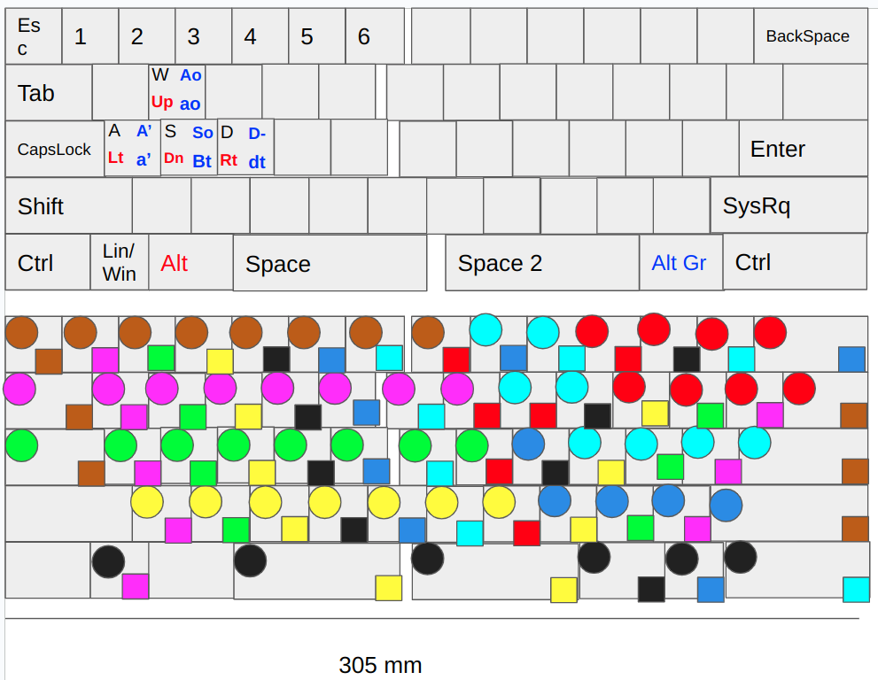

# Split-keyboard

This Git project contains everything that is needed for the construction of split 60 % keyboard. The layout used is a custom one (see layout) base on international qwerty. The project include:

- pcb files of a proof of concept with 4 switches
- pcb files of each of the keyboard sides
- a shopping list for all needed components
- cad, stl and gcode for the case files (gcode for an ender 3 with a probe)
- cad, stl and gcode for the keycaps (gcode for an anycubic proton)
- the driver module to use it on linux
- the driver module to use it on windows

## Layout
 

## Electronic specifiactions

This keyboard is a usb-c teather based one (no battey nor wireless connection provided yet). It is powered by an Atmega 328P stolen on an old arduino nano.

## Contribution

Contributions to this Git project are welcome! Please submit pull requests to the `dev` branch and include a detailed description of your changes.

## License

This project is licensed under the MIT License. See the `LICENSE` file for details.

